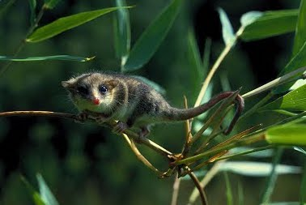

# Animal Activity :bug:

This repository contains useful code and example data on how to study and test hypotheses on animal activity.

Here we collected code from ongoing work at the lab (projects, dissertations, etc.) aiming to have a common source of analysis code to this purpose, free to use for anyone :smiley:

This repository has three parts (so far):

**01.- Introduction**. A brief introduction on animal activity (still under development, please be patience).

**02.- Circular statistics**. How to deal with time data using circular statistics, how to plot them and hypothesis-test.

**03.- Kernel density estimators**. Kernel density functions derived from activity data, including plots and hypothesis testing.

More coming soon... :metal: